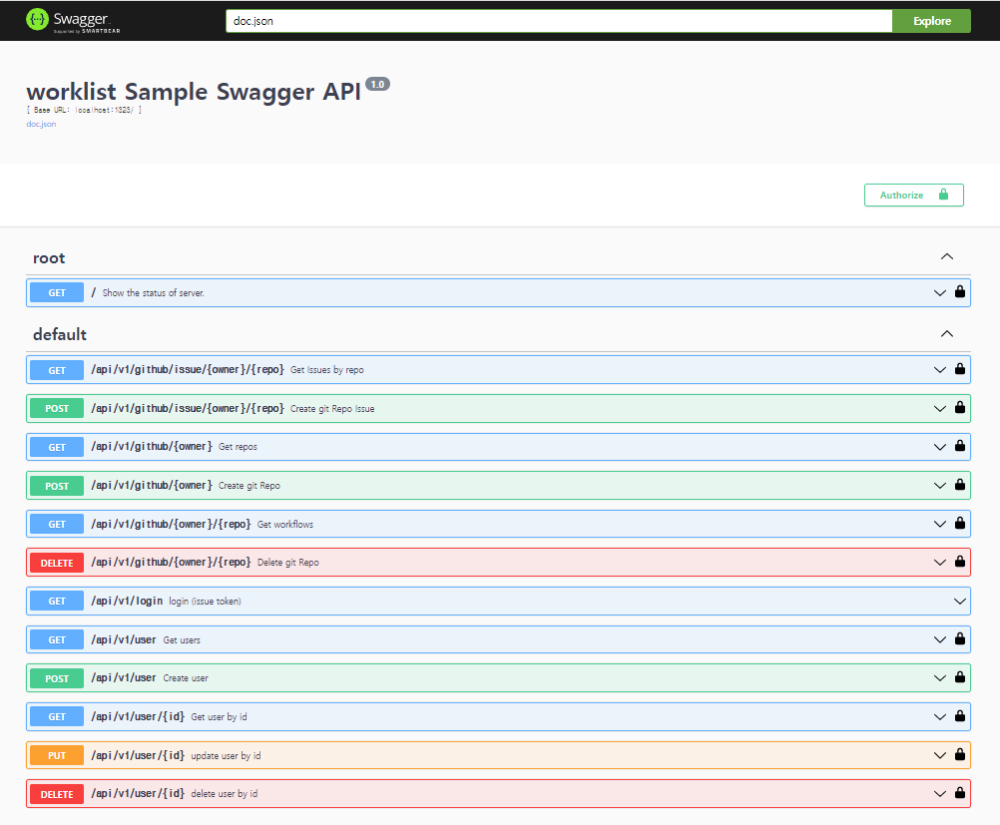

# Golang RestAPI (Echo)

> Import API list


```
    [framework]
    go.uber.org/fx
    github.com/labstack/echo/v4

    [docs]
    github.com/swaggo/echo-swagger

    [auth]
    github.com/labstack/echo-jwt/v4
    github.com/golang-jwt/jwt/v4

    [db]
    gorm.io/gorm
    gorm.io/driver/postgres
    gorm.io/driver/sqlite

    [github RestAPI]
    github.com/google/go-github/v50/github
    
    [gitlab RestAPI]
    github.com/xanzy/go-gitlab
```

> local start 

```
    config/config.toml 작성
    
    # github/gitlab 선택 가능 default github
    # git client 선택 github or gitlab
    gitClient = "github"
    
    # sqlite/postgre 선택 가능 default sqlite
    # db 선택 sqlite or postgre
    db ="postgre"

    go run main.go
```

> Project Map

```
- go-echo
  + config                  … global config 설정
  + docs                    … swagger
  + internal
    + pkg
      + domain              … github/gitlab api client handler
      + model               … db 관련 handelr(sqlite/postgres)       
      + security            … jwt 인증
      + github              … github RestAPI
      + user                … 사용자 RestAPI
  - main.go                 … Entry Point.
  ```


> swagger update 및 테스트 

```
    1. swagger update

    main.go 가 있는 폴더에서 아래 명령어 수행 

    swag init --parseDependency

    2. 테스트를 위한 jwt token 입력 

    [GET] /api/v1/login 수행 후 나온 토큰 값을 
    
    화면 우측상단에 Authorize 버튼을 누른 후 나온 창에 
    
    bearer 토큰값 형태로 입력 후 api 테스트 진행 
```

> swagger url : http://localhost:1323/swagger/index.html#/




   


